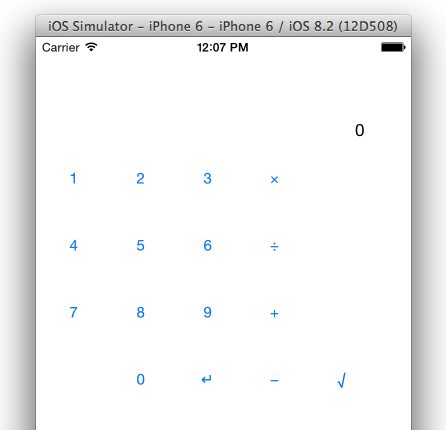

# Calculator

Developing iOS 8 Apps with Swift / Swift iOS 8 应用开发.

Calculator written in Swift. Stanford Open Course on iTunes U.
iTunes U 斯坦福大学开放课程, 计算器实例中文版，和英文版功能相同。

Swift 本身支持中文的变量和方法，本程序可直接运行。

(含第五讲新增部分)

## License

MIT License.
